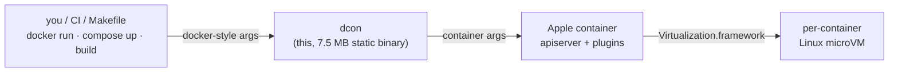
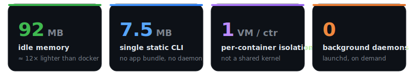
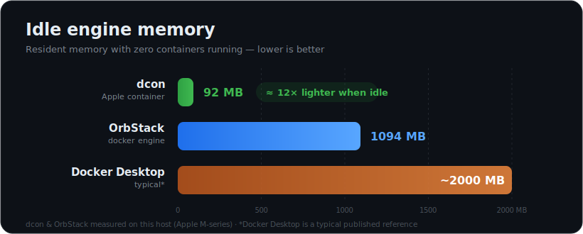
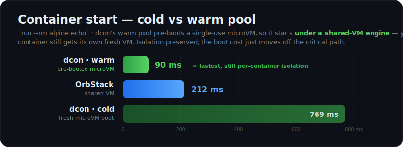

<div align="center">

# dcon

**A drop-in Docker CLI for macOS, powered by Apple's [`container`](https://github.com/apple/container) runtime.**

Speak `docker`. Run on Apple's per-container virtual machines. No daemon of its own, no desktop app — one 7.5 MB static binary.

[](https://github.com/o1x3/dcon/actions/workflows/ci.yml)
[](https://github.com/o1x3/dcon/releases)
[](https://github.com/o1x3/dcon/actions/workflows/ci.yml)
[](LICENSE)


</div>

---

```sh
curl -fsSL https://raw.githubusercontent.com/o1x3/dcon/main/install.sh | bash
```

```sh
dcon system start                              # start the backend (once)
dcon system kernel set --recommended           # install a guest kernel (once)
dcon run --rm alpine echo "hello from dcon"     # …and you're running containers
```

If your fingers and scripts already type `docker`, alias it and never look back:

```sh
alias docker=dcon        # or: curl … | DCON_LINK_DOCKER=1 bash
```

📖 **Want recipes?** The [cookbook (SECONDARY.md)](SECONDARY.md) has 15 end-to-end
scenarios — compose stacks, profiles, scaling, multi-arch builds, private
registries, Rosetta, debugging, and more.

---

## Why dcon

Apple's `container` runs real Linux containers in lightweight per-container VMs on
Apple silicon — fast, isolated, no always-on daemon. But its CLI is its own
dialect (`container ls`, `container image list`, different flags). Every Docker
muscle-memory command, script, CI pipeline, and Makefile speaks `docker`.

**dcon is the missing translation layer.** It implements the Docker command
surface — `run`, `ps`, `images`, `build`, `compose`, … — and maps each call to
`container`, re-rendering output in the familiar Docker format.



## Benchmarks

Measured on this host — Apple silicon (Mac16,12), macOS 26 — comparing dcon
(Apple `container`) against the docker engine installed here (**OrbStack**, one of
the leanest docker backends; vs Docker Desktop the memory gap is *larger*).
Reproduce with `make bench`.

<p align="center"></p>

### Idle memory — ~12× lighter

When no containers are running, Apple `container`'s services idle at ~90 MB and
microVMs exist only while a container is up. The docker engine keeps a full Linux
VM resident the whole time.

<p align="center"></p>

### The honest tradeoff

dcon boots a **fresh microVM per container** — stronger isolation, but a higher
cold start than a shared-VM engine. If you want maximum per-container isolation
and a near-zero idle footprint, dcon wins. If you want the absolute fastest
container churn, a shared-VM engine is faster today.

<p align="center"></p>

### Full numbers

| metric | dcon (Apple container) | docker (OrbStack) |
|---|---|---|
| **idle engine memory** | **92 MB** | 1094 MB |
| **CLI** | **7.5 MB static binary** | app bundle (100s of MB) |
| **isolation** | **per-container microVM** | shared Linux VM |
| **background footprint** | launchd helper, on-demand | persistent VM |
| container start (`run --rm alpine echo`) | 741 ms | 207 ms |
| cold `pull alpine` | ~20 s¹ | ~3 s |

¹ network/registry-bound on this run; dcon defaults to 3 concurrent layer downloads.

## Install

**One-liner (recommended):**

```sh
curl -fsSL https://raw.githubusercontent.com/o1x3/dcon/main/install.sh | bash
```

Knobs: `DCON_VERSION=v1.2.3`, `DCON_PREFIX=/usr/local`, `DCON_LINK_DOCKER=1`
(also symlink `docker`), `DCON_FROM_SOURCE=1` (build with Go).

**From source:**

```sh
git clone https://github.com/o1x3/dcon.git && cd dcon
make install            # builds + installs /usr/local/bin/dcon
make link-docker        # optional: symlink docker -> dcon
```

**Homebrew-style manual:**

```sh
go build -o dcon . && sudo mv dcon /usr/local/bin/
```

## Setup

dcon needs Apple's `container` runtime present (it is the engine):

1. **Install Apple `container`** from <https://github.com/apple/container/releases>
   (or `brew install --cask container`).
2. **Start the backend** (one time): `dcon system start`
3. **Install a guest kernel** (one time): `dcon system kernel set --recommended`

Read-only commands (`ps`, `images`, `volume ls`, …) work without a kernel;
booting containers needs it.

## Command parity

Every entry below is a real dcon command. ✅ full · ≈ best-effort · 🍏 Apple-native
extra · ⛔ genuinely unsupported by the backend (returns a clear message).

<details open>
<summary><b>Containers</b></summary>

`run` `create` `ps` `exec` `start` `stop` `restart` `kill` `rm` `logs` `inspect`
`cp` `export` `stats` `top` `port` `attach` `wait` `container prune` — ✅, with
full Docker→container flag translation and Docker-style `ps`/`stats` tables.
`pause`/`unpause`, `rename`, `commit`, `diff`, `update` — ⛔ (backend can't).
</details>

<details>
<summary><b>Images &amp; registry</b></summary>

`images` `pull` `push` `rmi` `tag` `build` `save` `load` `image prune`
`login` `logout` — ✅. `history` — ≈ (from OCI config). `search` — ⛔.
Docker `--mount`/`--output`/`--cache-from` comma-bearing values handled
correctly via non-splitting flags.
</details>

<details>
<summary><b>Volumes · networks · system</b></summary>

`volume create/ls/rm/inspect/prune`, `network create/ls/rm/inspect/prune` — ✅.
`version` `info` `system df` `system prune` — ✅ (synthesized Docker output).
`network connect/disconnect`, `events` — ⛔.
</details>

<details>
<summary><b>Compose — <code>dcon compose …</code></b></summary>

A built-in engine parses `compose.yaml` / `docker-compose.yml` and maps services
onto `container`:

`up` (`-d`, `--build`, `--no-start`, `--force-recreate`) · `down` (`-v`) · `ps` ·
`logs` (`-f`, aggregated & service-prefixed) · `build` · `pull` ·
`start`/`stop`/`restart`/`kill`/`rm` · `run` · `exec` · `create` · `config` ·
`ls` · `top` · `images` · `version`.

Honors `image`, `build` (context/dockerfile/args/target), `command`/`entrypoint`,
`environment`, `env_file`, `ports`, `volumes` (relative-path resolution),
`networks`, `depends_on` (ordering), `labels`, `working_dir`, `user`, `platform`,
`cpus`, `mem_limit`, `privileged`, `cap_add/drop`, `dns`, `tty`, `init`,
`shm_size`, `tmpfs`, `read_only`, `container_name`, plus `${VAR:-default}`
interpolation. Standard `com.docker.compose.*` labels make `dcon ps` /
`dcon compose ls` project-aware.
</details>

<details>
<summary><b>Apple-native extras (🍏 beyond Docker)</b></summary>

`dcon machine …`, `dcon builder start/status/stop/rm`,
`dcon system dns/kernel/property/logs/start/stop/status`, and run/build extras
`--rosetta` `--ssh` `--virtualization` `--os` `--arch` `--kernel` `--init-image`
`--publish-socket` `--no-dns` `--dns-domain`.
</details>

### Compatibility shims

Docker flags the backend can't honor are **accepted and ignored with a warning**
(not errors), so scripts and compose files keep working: `--restart`,
`--hostname`, `-P/--publish-all`, `--add-host`, `--device`, `--gpus`, `--sysctl`,
`--memory-swap`, `--cpu-shares`. `--privileged` is approximated as `--cap-add ALL`.

## Development

```sh
make build        # build ./dcon (version injected via ldflags)
make test         # go test ./...
make cover        # coverage summary
make bench        # dcon vs docker benchmark (scripts/bench-results.md)
make vet fmt
```

Layout:

```
main.go                 entrypoint
cmd/                    one file per command group (cobra)
internal/runtime/       locate + drive the `container` binary
internal/dockerfmt/     JSON models + Docker-style table/template rendering
internal/compose/       compose parser + service→container translation
scripts/                install / bump-version / coverage / bench
.github/workflows/      CI (test+coverage) and tagged Release pipeline
```

## Releases & versioning

- CI runs vet + race tests + coverage + cross-build on every push/PR, and
  auto-refreshes the coverage badge above on `main`.
- Cutting a release is one command:

  ```sh
  scripts/bump-version.sh patch     # or minor | major | vX.Y.Z
  ```

  It tags and pushes; the **Release** workflow then builds `darwin/arm64` +
  `darwin/amd64` binaries, generates checksums and notes, and publishes a GitHub
  Release that `install.sh` consumes.

## License

[MIT](LICENSE). dcon is an independent project, not affiliated with Apple or
Docker.
