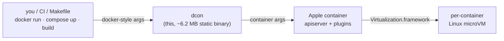

# dcon

A drop-in Docker CLI for macOS, powered by Apple container. Speak `docker`, run on Apple's per-container VMs from one ~6.2 MB static binary. Ships with **Dcon.app**, a native menubar + window GUI over the same CLI.

<div align="center">

[](https://github.com/o1x3/dcon/actions/workflows/ci.yml)
[](https://github.com/o1x3/dcon/releases)
[](https://github.com/o1x3/dcon/actions/workflows/ci.yml)
[](LICENSE)


</div>

```sh
curl -fsSL https://raw.githubusercontent.com/o1x3/dcon/main/install.sh | bash
```

```sh
dcon system start                              # start the backend (once)
dcon system kernel set --recommended           # install a guest kernel (once)
dcon run --rm alpine echo "hello from dcon"     # …and you're running containers
```

<div align="center">


</div>

If your fingers and scripts already type `docker`, alias it:

```sh
alias docker=dcon        # or: curl … | DCON_LINK_DOCKER=1 bash
```

## Why dcon

Apple's `container` runs Linux containers in per-container VMs on Apple silicon,
but its CLI is its own dialect. dcon is the translation layer: a static binary
that implements the Docker command surface (`run`, `ps`, `images`, `build`,
`compose`, …), maps each call to `container`, and re-renders output in the Docker
format.



## Headline: warm-pool start latency

A fresh microVM per container means a higher cold start (~700 ms) than a
shared-VM engine. dcon's warm pool closes the gap: pre-boot a single-use microVM
and `exec` the workload into it. Each member is handed out once then destroyed,
so isolation is identical to a cold run; only the VM boot moves off your critical
path. The result starts in ~90 ms, under an always-warm shared-VM engine, while
still giving every container its own VM.

<p align="center"></p>

dcon is also ~12× lighter at idle than OrbStack. See the full numbers, memory,
and pull benchmarks in [Benchmarks & Comparison](https://github.com/o1x3/dcon/wiki/Benchmarks-and-Comparison).

## Warm pool in 10 seconds

```sh
dcon warm alpine                       # pre-boot 1 warm microVM (~700 ms, once)
dcon run --rm alpine echo hi           # served from the pool → ~90 ms
export DCON_WARM=auto                  # or: self-prime after every eligible run
```

Simple `--rm` runs are served from the pool; runs that need bind mounts, ports,
resource limits, or custom networking fall back to a cold boot. Full eligibility
rules, env knobs, and internals: [Warm Pool](https://github.com/o1x3/dcon/wiki/Warm-Pool).

## Install

**One-liner (recommended):**

```sh
curl -fsSL https://raw.githubusercontent.com/o1x3/dcon/main/install.sh | bash
```

Knobs: `DCON_VERSION=v1.2.3`, `DCON_PREFIX=/usr/local`, `DCON_LINK_DOCKER=1`
(also symlink `docker`), `DCON_FROM_SOURCE=1` (build with Go).

**Homebrew:**

```sh
brew tap o1x3/dcon https://github.com/o1x3/dcon
brew install dcon          # installs the binary + shell completions
```

**From source:**

```sh
git clone https://github.com/o1x3/dcon.git && cd dcon
make install            # builds + installs /usr/local/bin/dcon
make link-docker        # optional: symlink docker -> dcon
```

Shell completions ship for bash, zsh, and fish: `dcon completion zsh|bash|fish`
(Homebrew installs them automatically).

## Setup

dcon needs Apple's `container` runtime (it is the engine). The one-line installer
above sets it up for you; to do it by hand, install the signed package from
<https://github.com/apple/container/releases>, then:

```sh
dcon system start                       # start the backend (once)
dcon system kernel set --recommended    # install a guest kernel (once)
dcon doctor                             # verify backend, kernel, builder, warm pool
```

Read-only commands (`ps`, `images`, `volume ls`, …) work without a kernel;
booting containers needs it.

## Repository layout

Two deliverables, one repo:

| Path | What | Build |
|---|---|---|
| `/` (Go) | the `dcon` CLI — the source of truth for all container behavior | `make build` · `make test` |
| `app/` (Swift) | **Dcon.app**, a SwiftUI menubar + window GUI that drives the dcon binary | `make app-build` · `make app-test` |

The app shells out to the embedded dcon CLI for everything (lists via
`--format json`, streams via `logs -f`/`events`, interactive shells via
Terminal), so GUI behavior is 1:1 with the CLI by construction.

```sh
make app-bundle    # assemble app/dist/Dcon.app (embeds the dcon binary)
make app-run       # build + open the app
make app-dmg       # package a DMG
```

Building the app locally needs full Xcode (SwiftUI macros don't ship with the
Command Line Tools): `sudo xcode-select -s /Applications/Xcode.app` or
`export DEVELOPER_DIR=/Applications/Xcode.app/Contents/Developer`.

Releases are driven by version files on `main`: bump [`VERSION`](VERSION) for the
CLI or [`app/VERSION`](app/VERSION) for Dcon.app. The matching release workflow
reads the file, builds, creates a `v*` / `app-v*` tag, and publishes a GitHub
Release ([Release](.github/workflows/release.yml),
[App Release](.github/workflows/app-release.yml)).

## Documentation

Everything else lives in the [wiki](https://github.com/o1x3/dcon/wiki):

- [Warm Pool](https://github.com/o1x3/dcon/wiki/Warm-Pool) — eligibility, env knobs, correctness, and the daemonless internals.
- [Benchmarks & Comparison](https://github.com/o1x3/dcon/wiki/Benchmarks-and-Comparison) — start, memory, and pull numbers vs OrbStack and Docker Desktop.
- [Command Parity](https://github.com/o1x3/dcon/wiki/Command-Parity) — the command/flag matrix, compose support, Apple-native extras, and compatibility shims.
- [Architecture](https://github.com/o1x3/dcon/wiki/Architecture) — the translation pipeline, source layout, development, and releases.
- [Cookbook (SECONDARY.md)](https://github.com/o1x3/dcon/blob/main/SECONDARY.md) — 15 end-to-end scenarios: compose stacks, profiles, scaling, multi-arch builds, private registries, Rosetta, debugging, and more.

## License

[MIT](LICENSE). dcon is an independent project, not affiliated with Apple or
Docker.
